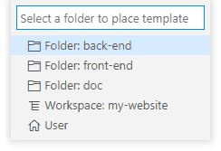
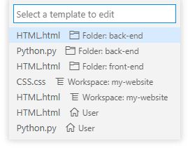

The extension supports:

* [Create files from defined templates](#file-templates)
* [Save As current file N times](#save-as-n-times)

# File Templates

Create files from defined templates. Templates can be defined at different levels: Extension, User, Workspace and Folder.

Based on the extension [File Templates for VSCode](https://marketplace.visualstudio.com/items?itemName=bam.vscode-file-templates) by Venkatesh Boddu.

This extension can be used as a replacement for **File Templates for VSCode**. It uses the same command names and key bindings.

It fixes a number of problems and adds a few features.

* command `template.newTemplateFromFile` is renamed to `templates.newTemplateFromFile`<br/>Change this if you have a custom key binding.
* no restriction on naming the template
* add a few variables for File Path and Custom Date, User input and Snippets

## Features

* Create new files from defined templates.
* Create new File Templates either from an existing file or a blank file.
* Edit User defined Templates.
* Use [variables](#template-variables) for Author Name, Date, File Path, User input and Snippets.

## Usage

* If you select an entry in the File Explorer and use the Context menu (Right-click) you will see a menu entry **New File from Template**.<br/>
  If the Explorer entry is a directory the new file will be created in this directory.<br/>
  If the Explorer entry is a file the new file will a sibling.<br/>
  It shows a menu with existing templates. Select the desired template and enter the new file name without extension. The new file will get the same extension as the selected template.
* In the  Context menu (Right-click) of the editor you will see menu entries:
    * **New File from Template** : Create a new file that is a sibling of the current file.
    * **New Template from File** : Use the current active document as a start for a new template.<br/>You are asked in which directory you want this template stored and with which name.

      <br/>
      _Theme: Light+_

    * **Next Snippet in File** : the [`${snippet}` variables](#template-variables) needs to be evaluated after creation of the file because the editor needs to be put in _Snippet_ mode. This also resolves the `${cursor}` variable as a final snippet.<br/>If there are no `${snippet}` or `${cursor}` variables nothing happens.
* From the Command Palette you can select:
    * **Files: New File from Template** (`templates.newFileFromTemplate`) - to create a new file from a template
    * **Files: New File Template** (`templates.newTemplate`) - to create a new blank file template.
    * **Files: New Template from File** (`templates.newTemplateFromFile`) - to create a new template from the current active file.
    * **Files: Edit File Template** (`templates.editTemplate`) - to edit a template.

      <br/>
      _Theme: Light+_

    * **Files: Next Snippet in File** (`templates.nextSnippet`) - to evaluate the next `${snippet}` variable.
* You can define [variables](#template-variables) in the templates for Author Name, Date, File Path, User input and Snippets

If you use snippet variables often it might be handy to define a key binding for the command: `templates.nextSnippet`

## Templates Location

The templates can be stored in several locations:

* **Extension** : The extension has a number of predefined templates that can not be edited or add to. After an update of the extension these edits would be gone.
* **User** : in a user defined directory from the setting `templates.folder` in the User settings (a good location is `<homedir>/.vscode/templates`, the installed extensions are stored in a sibling directory) (Optional)
* **Multiroot Workspace** : in a user defined directory from the setting `templates.folder` in the Workspace settings (`.code-workspace` file) (Optional)
* **Worksapce/Folder** : When one folder is open the templates are stored in the directory `.vscode/templates`

Each location is more specific of where the template can be used. Templates with the same name override templates on a more generic level. When you need to select a template to create from it shows the location of the template and the more specific ones are listed first

A directory is only created when store a new template in that directory.

## Template variables

In the template you can define a number of variables. They are evaluated at file creation time except for `${snippet}`.

A number of variables is identical to the [variables that can be used in `tasks.json` and `launch.json`](https://code.visualstudio.com/docs/editor/variables-reference#_predefined-variables):

* `${relativeFile}` - the current opened file relative to workspaceFolder
* `${relativeFileDirname}` - the current opened file's dirname relative to workspaceFolder
* `${fileBasename}` - the current opened file's basename
* `${fileBasenameNoExtension}` - the current opened file's basename with no file extension
* `${fileExtname}` - the current opened file's extension

The next use settings:

* `${author}` : use the value for setting `templates.author`
* `${date}` : show the current date and time in a fixed format, for historic reasons this variable is still allowed.

The next variables need additional information. This is part of the variable and needs to be specified using separator strings.

<code>${<em>variableName</em> <em>separator</em> <em>properties</em> <em>separator</em>}</code>

All _`separator`_'s used in a variable need to be the same.

The _`separator`_ is a string of 1 or more characters that are not part of the a to z alfabet, `$` or `{}`, in regular expression `[^a-zA-Z{}$]+`. Choose a character string that is not used in the  _`properties`_ part. If you need to use more than 1 character be carefull if you use the same character, you can experience unwanted behavior. The reason is that JavaScript regular expression does not have non-backtrack greedy quantifier. Currently the variable is matched with 1 regular expression. This makes everything easy to implement.

In the description the `:` is used as the separator, choose a different one if you use this character in the variable property.

* `${dateTimeFormat}` : use the setting `templates.dateTimeFormat` to construct a [date-time](#variable-datetimeformat).
* `${dateTimeFormat:name:}` : use a _named_ format in the setting `templates.dateTimeFormat` to construct a [date-time](#variable-datetimeformat). The format properties override what is defined in `templates.dateTimeFormat`.

* `${input:description:}` : Ask the user some text and use the _`properties`_ part as the description for the InputBox<br/>
  Example: `${input:Title of this page:}`
* `${snippet:definition:}` : you can use the full syntax of the [Visual Studio Code snippets](https://code.visualstudio.com/docs/editor/userdefinedsnippets#_snippet-syntax).<br/>A snippet is evaluated after the file is created with the command: **Next Snippet in File** from the Context Menu or Command Palette. The editor needs to be put in _Snippet_ mode. Apply this command for every `${snippet}` or `${cursor}` variable still in the file.<br/>
  Example: `${snippet##${1|*,**,***|} ${TM_FILENAME/(.*)/${1:/upcase}/} ${1}##}`

If a snippet does not need user interaction (variable transforms) it could be done at file creation but determining this automatic might be a ToDo item.

A final empty variable to place the cursor:

* `${cursor}` : If you want the cursor to end in a specific location after the file is created or as a last snippet use this variable

## Variable dateTimeFormat

This variable `${dateTimeFormat}` uses the setting `templates.dateTimeFormat`. It can use the unnamed format properties or you can use <em>name</em>d format properties: <code>${dateTimeFormat:<em>name</em>:}</code> (example uses separator `:`)

The setting `templates.dateTimeFormat` is an object with properties that are used to call [`Intl.DateTimeFormat`](https://developer.mozilla.org/en-US/docs/Web/JavaScript/Reference/Global_Objects/DateTimeFormat) to create a language-sensitive format of the current date and time.

The `locale` and `options` properties are the arguments for the [`Intl.DateTimeFormat` constructor](https://developer.mozilla.org/en-US/docs/Web/JavaScript/Reference/Global_Objects/DateTimeFormat/DateTimeFormat) and are optional.

The `locale` property can be a single string or an array of strings of language tags. If not specified the browser default locale is used.

The `template` property is an optional template string that uses the same placeholder syntax as the [Javascript template strings](https://developer.mozilla.org/en-US/docs/Web/JavaScript/Reference/Template_literals). You can add as many literal text as needed.

The only expressions valid are the `type` values returned by the [`Intl.DateTimeFormat.prototype.formatToParts()`](https://developer.mozilla.org/en-US/docs/Web/JavaScript/Reference/Global_Objects/DateTimeFormat/formatToParts) method. See first example.

If there is no `template` property the value parts of the `Intl.DateTimeFormat.prototype.formatToParts()` are joined. See second example.

### Named DateTime Formats

Any other property of `templates.dateTimeFormat` is a <em>name</em>d DateTimeFormat object that can define the properties `locale`, `options` and `template`. These properties override the values defined in `templates.dateTimeFormat`. See Example 3.

### Example 1

```json
    "templates.dateTimeFormat": {
      "locale": "en-US",
      "options": {
        "year": "numeric",
        "month": "2-digit",
        "day": "2-digit",
        "hour12": false,
        "hour": "2-digit",
        "minute": "2-digit",
        "second": "2-digit"
      },
      "template": "${year}/${month}/${day}-${hour}:${minute}:${second}"
    }
```

The result is

```
2020/03/19-18:01:18
```

### Example 2

You can use a different locale and number system and use the long format:

```json
    "templates.dateTimeFormat": {
      "locale": "fr-FR-u-nu-deva",
      "options": {
        "dateStyle": "full",
        "timeStyle": "full"
      }
    }
```

The result is

```
jeudi १९ mars २०२० à १७:५९:५७ heure normale d’Europe centrale
```

### Example 3 Named DateTime Formats

```json
    "templates.dateTimeFormat": {
      "locale": "en-US",
      "options": {
        "year": "numeric",
        "month": "2-digit",
        "day": "2-digit",
        "hour12": false,
        "hour": "2-digit",
        "minute": "2-digit",
        "second": "2-digit"
      },
      "template": "${year}/${month}/${day}-${hour}:${minute}:${second}",
      "year-only": { "template": "${year}" },
      "timeHMS": { "template": "${hour}:${minute}:${second}" }
    }
```

In the template use these variables (example uses `:` as separator):

```
${dateTimeFormat}
${dateTimeFormat:year-only:}
${dateTimeFormat:timeHMS:}
```

## Extension Settings

This extension has the following settings:

* `templates.author` : Set the Author name.
* `templates.Author` : Set the Author name. **Deprecated**: Please use `templates.author` instead.
* `templates.folder` : Define a File system path for a directory to save the templates at this level. Can only be defined at User and Multiroot Workspace level.
* `templates.dateTimeFormat` : An object describing the properties used by the [`${dateTimeFormat}` variable](#variable-datetimeformat)

## KeyBindings

* Create a New File from template

    * Windows:  <kbd>Ctrl</kbd>+<kbd>N</kbd>
    * MAC: <kbd>Cmd</kbd>+<kbd>N</kbd>

* New Untitled file (Visual Studio Code command: `workbench.action.files.newUntitledFile`)

    * Windows:  <kbd>Ctrl</kbd>+<kbd>Alt</kbd>+<kbd>N</kbd>
    * MAC: <kbd>Cmd</kbd>+<kbd>Alt</kbd>+<kbd>N</kbd>

# Save As N Times

If you need a series of files with filenames that have a sequence numbering and start all with the same content you can use the command "**Files: Save As N Times**" (`templates.fileSaveAsNTimes`). This command can also be found in the context menu of the editor.

The command asks to enter a file name template with fields. A field is a series of properties enclosed by `{{ }}`. The properties are comma separated _`key=value`_ pairs. The type of the field is determined by the property _`type`_. Based on the current file name a suggestion is shown in the input box with 1 field added just before the file extension.

A file name template can have 1 or multiple fields. If no field is found a message is shown and no new file is created.

At the moment only a numeric field (`type=N`) is possible.

If a property has a numeric value this can be entered with prefix `0b` and `0x` for respective base 2 and 16.

The other properties are:

* Numeric field (`type=N`)

    * <code>from=<em>number</em></code> : the starting number of this field (default: 1)
    * <code>to=<em>number</em></code> : the last number of this field (default: 5)
    * <code>size=<em>number</em></code> : if `size` is defined, the number is padded with `0`'s on the left to get a string of the given size (default: undefined)
    * <code>base=<em>number</em></code> : the base of the number of this field, allows you to generate numbers with base, 2, 8, 16. Possible values [2, 36] (default: 10)

    If `from >= to` no files will be created.

    Using negative values for `from` and `to` give unexpected results, the `-` sign is not the start character of the resulting string of the field.

The file copies are saved in the same folder as the current file. No file will be overwritten. If the files need to be replaced you have to delete them first.

## Example with multiple fields

The following file name template:

```
page-{{type=N,size=2,from=1,to=3}}-{{type=N,size=3,from=1,to=5}}.html
```

generates the following files:

```
page-01-001.html
page-01-002.html
page-01-003.html
page-01-004.html
page-01-005.html
page-02-001.html
page-02-002.html
page-02-003.html
page-02-004.html
page-02-005.html
page-03-001.html
page-03-002.html
page-03-003.html
page-03-004.html
page-03-005.html
```

## TODO

* support multiple `${cursor}` variables. To get a Multi Cursor after creating a file from a template

## Release Notes

### 1.2.0 Save As N Times

### 1.1.0 named dateTimeFormats

### 1.0.0

Initial release of File Templates
